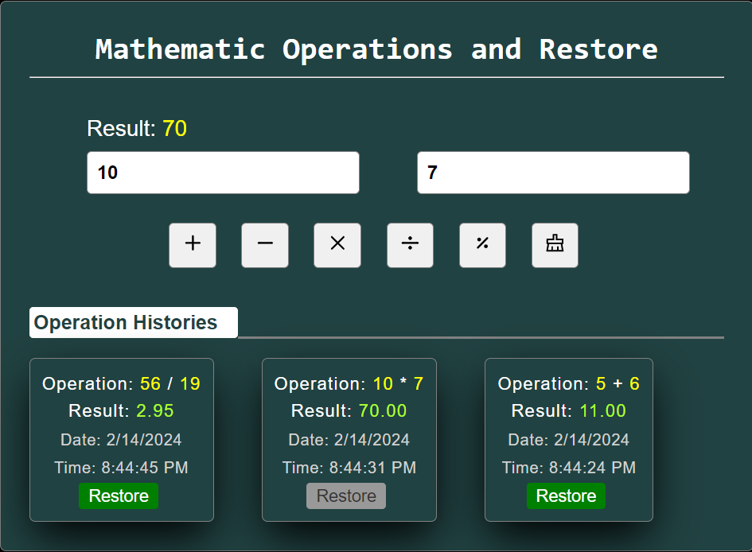

# Mathematical Operation and Restore

A simple React project that allows users to perform basic mathematical operations (+, -, *, /) on two inputs. The project also includes a history section to dynamically display the operations and their results. Users can restore specific operations from the history.

## Features
- Perform basic mathematical operations (+, -, *, /) on two inputs.
- Display dynamic history of operations and their results.
- Restore specific operations from the history.

